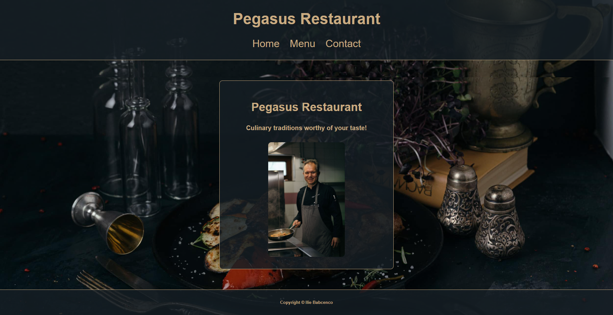
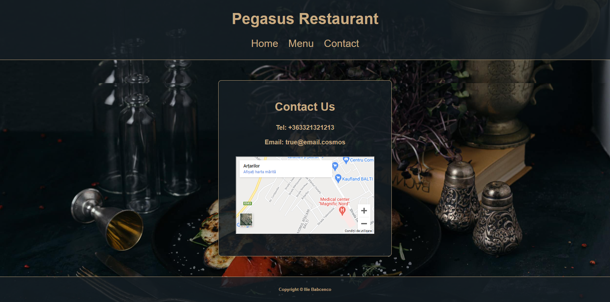
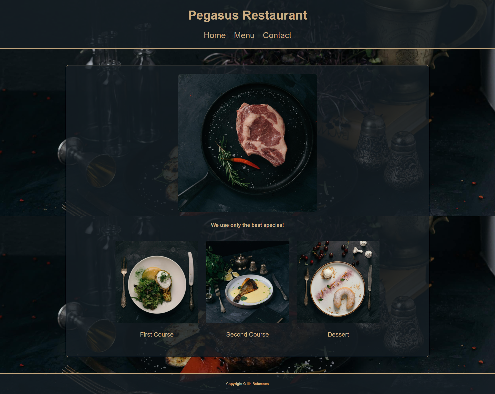

# Restaurant Page

## Description

This is a JavaScript project from Odin's curriculum. It is based on DOM manipulation by dynamically rendering a simple restaurant homepage.
There I used JavaScript alone to generate the entire contents of the website.

## Built With

- JavaScript
- Webpack

## Set up this projecect locally

- Open the terminal in the directory where you want to install the app;
- Run command `git@github.com:iliebabcenco/restaurant-page.git` which will clone the project;
- Switch to the main directory of project using cd;
- Run `npm install webpack webpack-cli --save-dev` in your computer terminal to install Webpack (you will need Node.js installed on your machine);
- Open index.html file in your browser;
- Use it.

## How it looks

| View on mobile version             |
| ---------------------------------- |
|  |
|  |
|  |

### Deployment

This application is deployed on [GitHubPages](https://iliebabcenco.github.io/restaurant-page/).

## Authors

👤 **Ilie Babcenco**

  

## 🤝 Contributing

Contributions, issues, and feature requests are welcome!

If you want to contribute, you can clone this project or fork it.

If you found an issue, feel free to check the [issues page](https://github.com/iliebabcenco/my-telegram-bot/issues).

## Show your support

Give a ⭐️ if you like this project!

## Acknowledgments

- [Microverse](https://www.microverse.org/)
